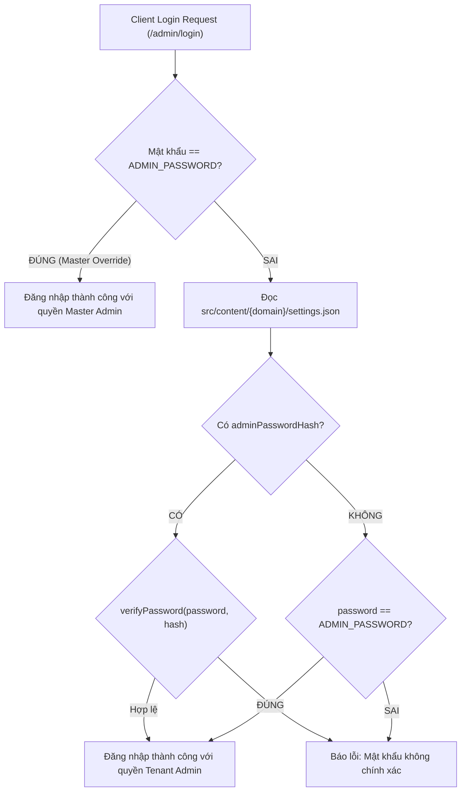

# 🚀 Quy trình Chuẩn (SOP): Khởi tạo & Bàn giao Tenant (Admin Master)

Tài liệu hướng dẫn quy trình vận hành dành riêng cho **Master Admin** khi khởi tạo không gian số mới (Tenant), cấu hình tên miền riêng, thiết lập mật khẩu và bàn giao quyền tự quản cho khách hàng trên nền tảng **Edge Multi-Tenant JSON CMS**.

---

## 📑 Mục lục
1. [Tổng quan Kiến trúc Multi-Tenant](#1-tổng-quan-kiến-trúc-multi-tenant)
2. [Quy trình 4 Bước Khởi tạo & Bàn giao](#2-quy-trình-4-bước-khởi-tạo--bàn-giao)
   - [Bước 1: Khởi tạo Tenant trên Master Dashboard](#bước-1-khởi-tạo-tenant-trên-master-dashboard)
   - [Bước 2: Cấu hình DNS & Tên miền Khách hàng](#bước-2-cấu-hình-dns--tên-miền-khách-hàng)
   - [Bước 3: Kiểm tra & Nghiệm thu Trước bàn giao](#bước-3-kiểm-tra--nghiệm-thu-trước-bàn-giao)
   - [Bước 4: Bàn giao Thông tin cho Khách hàng](#bước-4-bàn-giao-thông-tin-cho-khách-hàng)
3. [Cơ chế Bảo mật & Quản trị Mật khẩu](#3-cơ-chế-bảo-mật--quản-trị-mật-khẩu)
4. [Xử lý Khi Khách Quên Mật khẩu (Password Recovery)](#4-xử-lý-khi-khách-quên-mật-khẩu)
5. [Bảng Kiểm Nhanh (Checklist Bàn giao)](#5-bảng-kiểm-nhanh-checklist-bàn-giao)

---

## 1. Tổng quan Kiến trúc Multi-Tenant

Nền tảng vận hành trên mô hình **Single Codebase, Multi-Tenant Edge Architecture**:
- **Độc lập Dữ liệu (Data Isolation)**: Mỗi tenant sở hữu một thư mục riêng biệt tại `src/content/{domain}/`, bao gồm toàn bộ bài viết (`posts.json`), dự án (`projects.json`), video (`videos.json`), danh mục (`categories.json`), leads liên hệ (`leads.json`) và cấu hình (`settings.json`).
- **Phân giải Tên miền Tự động (Domain Resolution)**: Hook server (`src/hooks.server.js`) tự động đọc `url.hostname` từ request, cô lập context của từng tenant mà không cần database SQL phức tạp.
- **Lưu trữ Git-backed**: Dữ liệu đồng bộ trực tiếp lên GitHub repository qua API với token bảo mật, hỗ trợ cache Edge toàn cầu qua CDN.
- **Bảo mật Edge-native**: Quản lý mật khẩu bằng thuật toán **PBKDF2-SHA256** (100.000 vòng lặp, salt 16-byte ngẫu nhiên) sử dụng 100% Web Crypto API (`crypto.subtle`), hoàn toàn tương thích Cloudflare Workers & Vercel Edge.

---

## 2. Quy trình 4 Bước Khởi tạo & Bàn giao

### Bước 1: Khởi tạo Tenant trên Master Dashboard

1. Đăng nhập vào trang quản trị với quyền **Master Admin**:
   - Truy cập: `https://example.com/admin/login` (hoặc domain master).
   - Nhập `ADMIN_PASSWORD` của hệ thống.
2. Điều hướng vào menu **Quản lý Tenant** (`/admin/tenants`):
   *(Lưu ý: Mục này chỉ hiển thị khi đăng nhập ở root domain của Master Admin)*.
3. Điền các trường thông tin trong form **Tạo Tenant Mới**:
   - **Tên miền hoặc Mã định danh (`domain`)**:
     - Ví dụ tên miền riêng: `mybrand.com`, `my-studio.vn`
     - Ví dụ subdomain/test: `client1.example.com`, `test-brand`
   - **Mật khẩu Quản trị Ban đầu (`adminPassword`)**:
     - *Tùy chọn*: Nhập mật khẩu tùy chỉnh (tối thiểu 6 ký tự).
     - *Hoặc để trống*: Hệ thống tự động sinh ngẫu nhiên chuỗi mật khẩu an toàn dài 10 ký tự (loại bỏ ký tự dễ nhầm lẫn như 0/O, 1/l).
   - **Kiến trúc Trang chủ (`homeLayout`)**:
     - `Classic Editorial`: Dòng thời gian bài viết & dự án chuyên sâu.
     - `One-Page Consulting`: Trang đích chuyển đổi cao, bảng giá 3 gói dịch vụ, form đặt lịch.
     - `Bento Portfolio`: Ô thẻ bất đối xứng thời thượng cho Designer / Tech / Creator.
   - **Phong cách Giao diện (`themePreset`)**:
     - `Apple Minimalist`: Slate Titan & OLED Đen sâu tối giản.
     - `Editorial & Academic`: Giấy kem ấm, học thuật và thanh lịch.
     - `Executive & Finance`: Navy hoàng gia & vàng kim sang trọng.
     - `Wellness & Medical`: Xanh ngọc y tế & bạc hà dịu mát.
   - **Hiển thị Phân hệ (`showBlog`, `showProjects`, `showVideos`)**: Bật/tắt theo nhu cầu thực tế của khách hàng.
4. Bấm **Khởi tạo Tenant**:
   - Hệ thống tự động sinh thư mục `src/content/{domain}/` với đầy đủ file JSON mẫu.
   - Mật khẩu được băm (hash) bảo mật và lưu vào `settings.json` (`adminPasswordHash`).
   - Tự động commit & push lên GitHub repository nếu đã cấu hình GitHub Token.
5. **Sao chép ngay Thông tin Bàn giao**:
   - Bảng thông tin màu xanh lá xuất hiện ngay đầu trang với các thông tin: Tên miền, Link đăng nhập, Tên tài khoản, Mật khẩu khởi tạo.
   - Bấm nút **"Sao chép thông tin bàn giao"** để lưu vào clipboard.

---

### Bước 2: Cấu hình DNS & Tên miền Khách hàng

Khi khách hàng sử dụng tên miền riêng (ví dụ `mybrand.com` hoặc `www.mybrand.com`), Master Admin thực hiện cấu hình kết nối:

#### A. Cấu hình trên Vercel / Cloudflare Project:
1. Truy cập **Vercel Dashboard** > Chọn Project > **Settings** > **Domains**.
2. Thêm domain của khách:
   - Thêm `mybrand.com` và `www.mybrand.com`.
3. Vercel sẽ cung cấp bản ghi DNS cần cấu hình.

#### B. Cấu hình bản ghi tại Nhà cung cấp Tên miền (DNS Registrar):
Gửi hướng dẫn cho khách hàng (hoặc cấu hình trực tiếp nếu quản lý DNS):

| Loại bản ghi (Type) | Tên bản ghi (Name/Host) | Giá trị đích (Target/Value) | Proxy Status |
| :--- | :--- | :--- | :--- |
| **CNAME** | `@` (hoặc root) | `cname.vercel-dns.com` | DNS Only (Nếu Cloudflare) |
| **CNAME** | `www` | `cname.vercel-dns.com` | DNS Only (Nếu Cloudflare) |
| **A** *(nếu không hỗ trợ CNAME root)* | `@` | `76.76.21.21` | DNS Only |

*Sau khi cấu hình xong, Vercel/Cloudflare sẽ tự động cấp phát chứng chỉ bảo mật SSL (HTTPS) trong 1–5 phút.*

---

### Bước 3: Kiểm tra & Nghiệm thu Trước bàn giao

Trước khi gửi tài khoản cho khách hàng, Master Admin kiểm tra:
1. **Kiểm tra Trang chủ**:
   - Truy cập: `https://{domain}`
   - Xác nhận giao diện hiển thị đúng Theme và Layout đã chọn.
2. **Kiểm tra Đăng nhập Tenant**:
   - Truy cập: `https://{domain}/admin/login`
   - Nhập mật khẩu khởi tạo đã cấp.
   - Xác nhận đăng nhập thành công vào Dashboard của tenant.
3. **Kiểm tra Quyền Master Admin Override**:
   - Đăng xuất, sau đó đăng nhập lại bằng `ADMIN_PASSWORD` của hệ sinh thái (Master Key).
   - Xác nhận Master Admin luôn vào được bất kỳ tenant nào để hỗ trợ kỹ thuật khi cần.

---

### Bước 4: Bàn giao Thông tin cho Khách hàng

Gửi tin nhắn bàn giao chính thức cho khách hàng theo mẫu chuẩn dưới đây:

```markdown
Chào [Tên Khách Hàng],

Không gian số độc lập của bạn đã được khởi tạo và sẵn sàng hoạt động!

🌐 Thông tin truy cập website:
- Trang chủ: https://[domain]
- Trang quản trị: https://[domain]/admin/login

🔐 Thông tin đăng nhập:
- Tài khoản: admin
- Mật khẩu khởi tạo: [Mật_khẩu_được_cấp]

💡 Khuyến nghị quan trọng:
1. Sau khi đăng nhập lần đầu, bạn hãy vào mục "Cài đặt" (Settings) -> Kéo xuống phần "Bảo mật & Mật khẩu Quản trị" để đổi sang mật khẩu cá nhân của bạn.
2. Tại mục "Cài đặt", bạn có thể cập nhật Tên thương hiệu, Tiểu sử, Email liên hệ, Số hotline và các liên kết mạng xã hội (Facebook, LinkedIn, GitHub, YouTube).
3. Bạn có thể bắt đầu đăng bài viết, dự án và cập nhật thông tin bất cứ lúc nào.

Chúc bạn xây dựng thương hiệu cá nhân thành công!
```

---

## 3. Cơ chế Bảo mật & Quản trị Mật khẩu

Hệ thống thiết kế kiến trúc phân quyền 2 lớp bảo vệ:



### 1. Master Admin Override (Chìa khóa Vạn năng)
- Master Admin nắm giữ biến môi trường `ADMIN_PASSWORD` trên Vercel/Server.
- Dù khách hàng đặt bất kỳ mật khẩu nào hay quên mật khẩu, Master Admin vẫn có thể đăng nhập trực tiếp vào bất kỳ tenant nào để hỗ trợ kỹ thuật.

### 2. Tenant Self-Service (Khách hàng tự quản mật khẩu)
- Khách hàng đăng nhập vào `https://{domain}/admin/settings`.
- Tại card **Bảo mật & Mật khẩu Quản trị**, khách hàng nhập mật khẩu cũ và mật khẩu mới (tối thiểu 6 ký tự).
- Mật khẩu mới được mã hóa an toàn và ghi đè vào `settings.json`.
- API không bao giờ trả hash mật khẩu về trình duyệt ở trang public hay admin loaders để bảo đảm an toàn dữ liệu.

---

## 4. Xử lý Khi Khách Quên Mật khẩu

Nếu khách hàng quên mật khẩu và không thể truy cập:

1. Master Admin đăng nhập vào trang chủ Master: `https://example.com/admin/login`.
2. Truy cập menu **Quản lý Tenant** (`/admin/tenants`).
3. Tìm tenant tương ứng trong danh sách hoạt động.
4. Bấm nút **"Đổi MK"** trên thẻ của tenant.
5. Modal hiện ra:
   - Nhập mật khẩu mới tùy ý, hoặc để trống để hệ thống tự sinh ngẫu nhiên 10 ký tự.
   - Bấm **"Xác nhận đổi mật khẩu"**.
6. Hệ thống băm lại mật khẩu, lưu vào `settings.json` của tenant đó và cập nhật lên GitHub.
7. Master Admin bấm **"Sao chép mật khẩu"** và gửi lại cho khách hàng.

---

## 5. Bảng Kiểm Nhanh (Checklist Bàn giao)

Trước khi bàn giao một Tenant mới, kiểm tra các mục sau:

- [ ] **Khởi tạo thư mục**: Đã có `src/content/{domain}/` với đầy đủ file JSON.
- [ ] **Mật khẩu ban đầu**: Đã lưu trữ hash trong `settings.json` và đã lưu bản plain-text để gửi khách.
- [ ] **DNS CNAME**: Đã trỏ CNAME về Vercel và trạng thái báo Valid (SSL Active).
- [ ] **Giao diện & Thương hiệu**: Đã chọn đúng Preset màu sắc và Layout theo yêu cầu khách.
- [ ] **Đăng nhập thử nghiệm**: Đã kiểm tra đăng nhập thành công với cả mật khẩu tenant và mật khẩu master.
- [ ] **Gửi thông điệp bàn giao**: Đã gửi hướng dẫn đăng nhập và lưu ý đổi mật khẩu cho khách.

---
*Tài liệu được biên soạn cho hệ thống Svelte Edge Multi-tenant CMS.*
